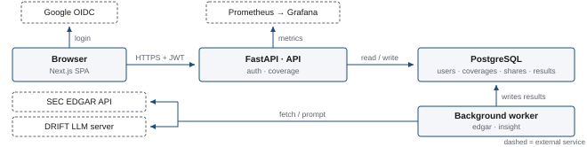

# CoverageDesk

*Tells you what shape a public company is in — in terms that are easy to understand.*

CoverageDesk lets a user register a **coverage**: a company they are tracking, together with the reason they care about it and the conditions they want to watch. The application then pulls that company's financial facts and filing history from the SEC EDGAR API, computes how the finances have moved and how openly the company reports, and turns those figures into plain language — with every statement traced back to the filing it came from.

The system has three roles. A **User** registers coverages and reads the results; this is who the product is for. A **Viewer** reads only the coverages a User has explicitly shared. An **Admin** operates the system — accounts and the health of the analysis pipeline — with no access to anyone's coverages.

**Author:** Eungchan Kang (`ekk5635`)
**Course:** SWENG 861 – Software Construction
**Project Category:** Project V — Bring Your Own Domain (approved by instructor, 2026-09-01)

---

## Current Status

**Week 2 — Deliverable I: Proposal & Checkpoint.**
This repository is initialized with the required structure and project information. No application code has been committed yet; implementation starts in Week 3.

## Architecture

Solid boxes are parts of this system; dashed boxes are external services. The full proposal is
`docs/proposal.pdf` (Deliverable I, Week 2).

## Planned Tech Stack

| Layer | Choice |
| :--- | :--- |
| Frontend | Next.js (React) |
| Backend | FastAPI (Python) |
| Database | PostgreSQL |
| Authentication | Google OAuth 2.0 / OIDC login, JWT session tokens, role-based access control |
| External API | SEC EDGAR `companyfacts` (XBRL financial data) and `submissions` (filing history) |
| LLM | DRIFT inference server provided for this course |
| Testing | pytest (server), Vitest with React Testing Library (client), Playwright (end-to-end) |
| Containers & CI | Multi-stage Docker build, Docker Compose, GitHub Actions, deployed to Render |
| Observability | Structured logging, Prometheus metrics, Grafana dashboard |

## Repository Structure

| Folder | Purpose |
| :--- | :--- |
| `.github/workflows` | CI/CD pipelines (Week 6) |
| `docs` | Proposal and architecture diagrams |
| `src/client` | Frontend application |
| `src/server` | Backend API, database logic, and the scheduled background worker |
| `ops/docker` | Dockerfiles and `docker-compose.yml` |
| `ops/observability` | Prometheus and Grafana configuration |
| `tests` | Unit, integration, security, and end-to-end test suites (Week 5) |

## How to Run

Not available yet — this repository currently contains no application code.
Local and Docker run instructions will be added here as the server and client are implemented (Weeks 3–6).

## AI Usage

AI assistance was used to draft this README and to scaffold the repository structure. All content was reviewed and edited by the author, who is responsible for its accuracy. A full AI reflection is part of the Week 7 final deliverable.

---
*This repository is for academic use. No secrets or API keys are committed; see `.gitignore`.*
