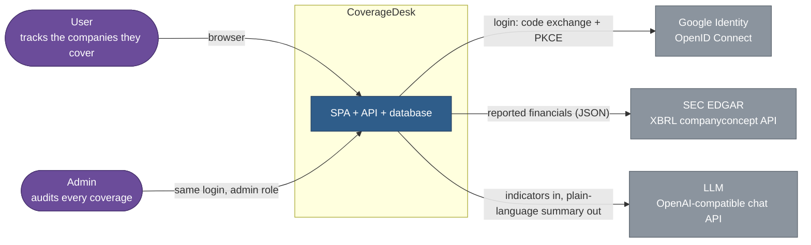
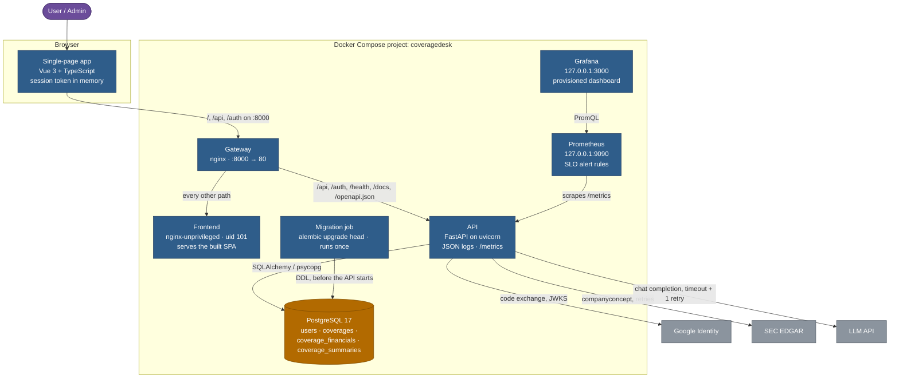
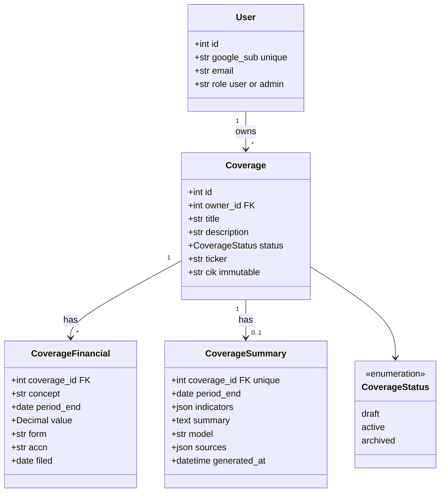
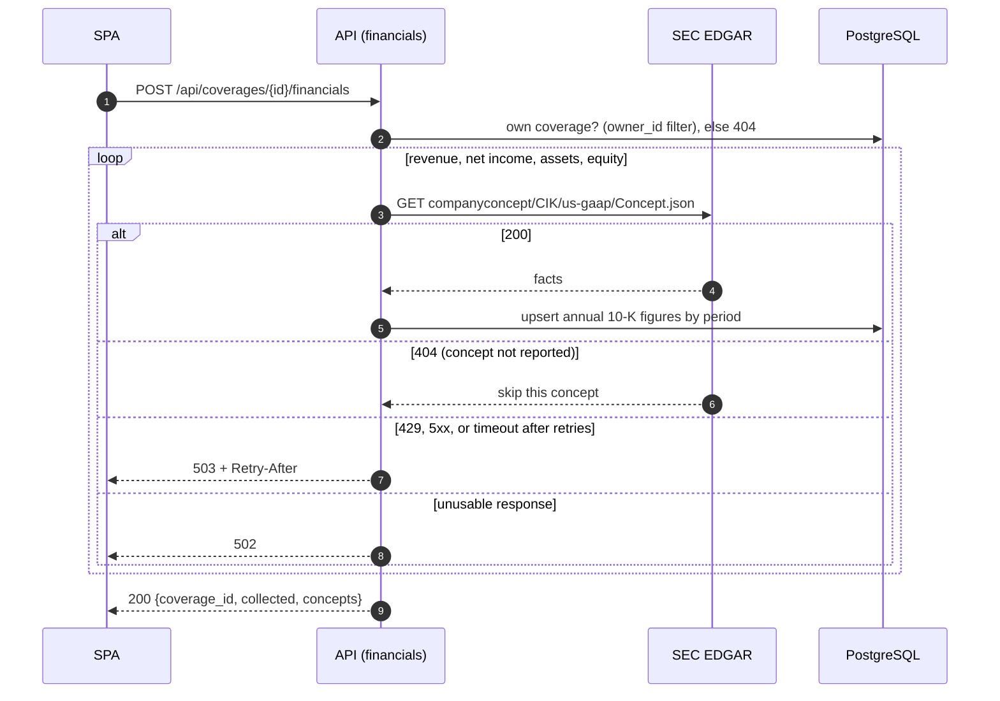
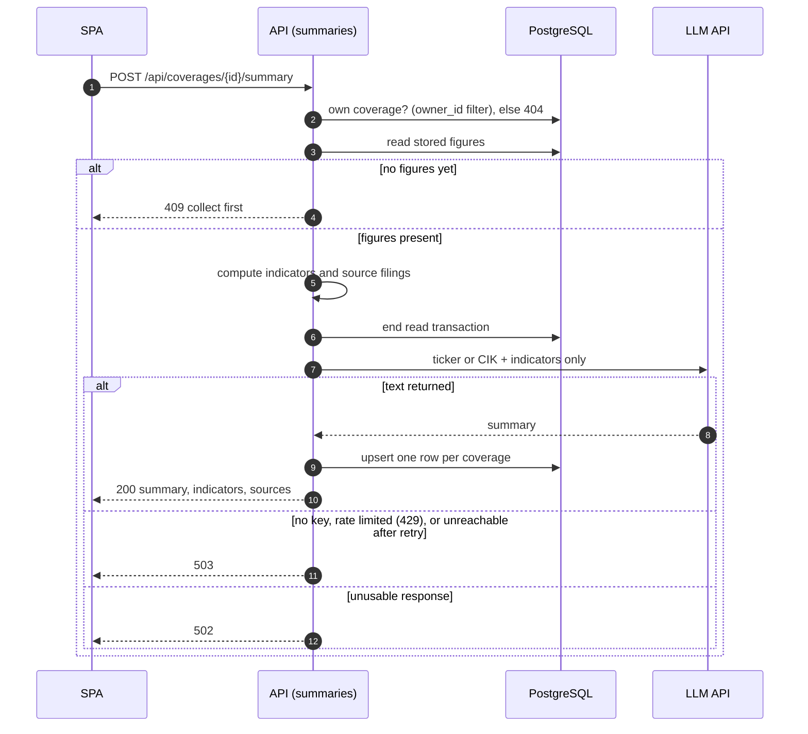

# Architecture

How CoverageDesk is built, from the system boundary down to the request flows. GitHub renders the diagrams below. Decisions that shaped them are in [`adr/`](adr/).

## 1. Context

Two kinds of users and three external systems. Only public data leaves the service: the LLM receives a ticker or CIK and computed indicators, never a user's own title or notes.

## 2. Containers

Everything below runs from `ops/docker/docker-compose.yml`. The gateway is the only port for app traffic. Prometheus and Grafana bind to `127.0.0.1`; PostgreSQL is published on 5432 for local tools and the test database.

### API modules (`src/server`)

| Module | Responsibility |
| :--- | :--- |
| `main.py`, `oidc.py`, `tokens.py` | Google login (code flow + PKCE) and the service's own session JWT |
| `security.py` | Bearer token check on every protected route; admin role check |
| `coverages.py` | Coverage CRUD, filtered by `owner_id` |
| `financials.py`, `edgar.py`, `edgar_collection.py` | Collect figures from EDGAR and store them per period |
| `indicators.py` | Pure computation: revenue growth, net margin, equity ratio, and their source filings |
| `insight.py` | LLM client: sends indicators, returns text, maps failures to typed errors |
| `summaries.py` | Generate, store, and read a coverage's summary |
| `admin.py` | Read-only list of all coverages for admins |
| `errors.py` | One JSON error shape for every failure, including upstream ones |
| `health.py`, `metrics.py`, `request_logging.py` | Health probes, Prometheus metrics, request ID and JSON logs |

## 3. Data model

Every coverage belongs to one user, and every query filters by that owner. A coverage has at most one stored summary.

`UNIQUE (owner_id, cik)`: one coverage per company per user; a duplicate answers 409.

## 4. Runtime flows

### 4.1 Collect financials

### 4.2 Generate a summary

The LLM is called only on POST; reading the summary is a plain database read. The database transaction is closed before the LLM call so a slow model does not hold a connection.

## 5. Quality measures

| Concern | How it is handled | Checked by |
| :--- | :--- | :--- |
| Multi-tenancy | `owner_id` from the token in every query; another user's row is a 404 | pytest (`test_coverages_api.py`, `test_summaries_api.py`) |
| Untrusted model output | Rendered as text, never as HTML; only `https://www.sec.gov/` links | Vitest (`CoverageSummary.spec.ts`) |
| Secrets | `.env` only; CI fails if a `.env` file is tracked; Trivy secret scan on images | CI `audit`, `package` |
| Dependencies and images | pip-audit, npm audit, Trivy on both images | CI `audit`, `package` |
| Availability | Health and readiness probes; SLO alerts on login success, API errors, and latency | CI `alert-rules` (promtool) |
| Code quality | ruff, ESLint and oxlint, 80% coverage gates on server and client | CI `backend`, `frontend` |
